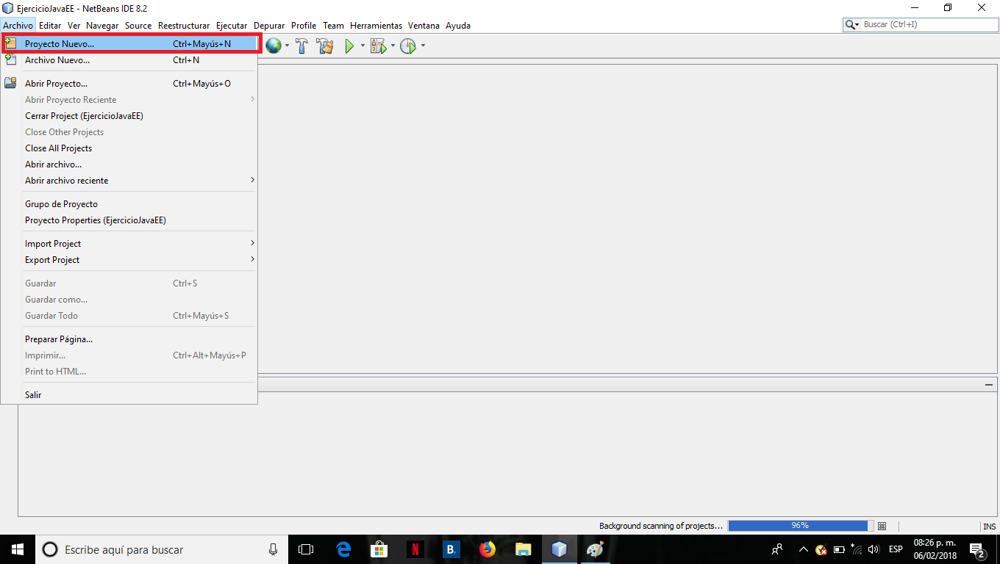

# Hola Mundo con Java EE

Los Java Server Pages(JSP) son componetes del lado del servidor, especializadoes en manejar codigo HTML, e incrustar código Java por
medio de etiquetas (tags).

Paso 1. Crear Proyecto.

